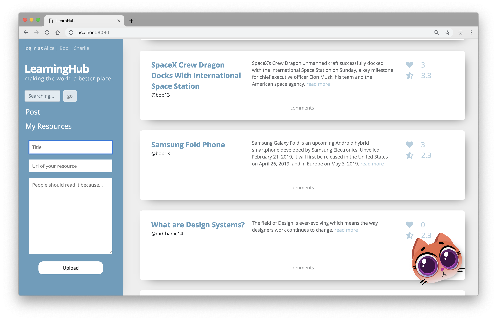
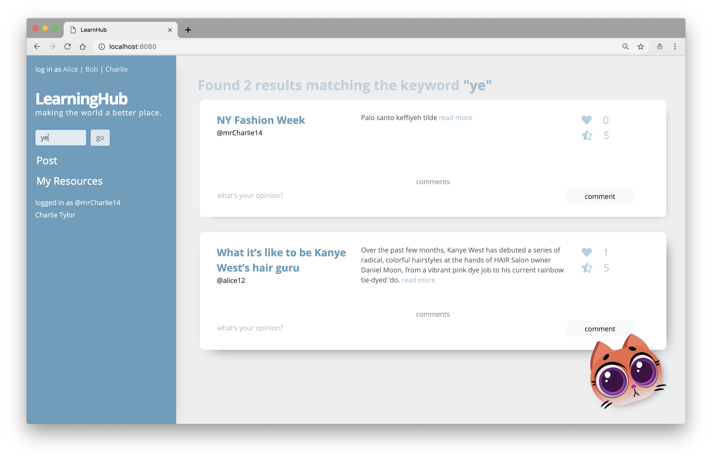
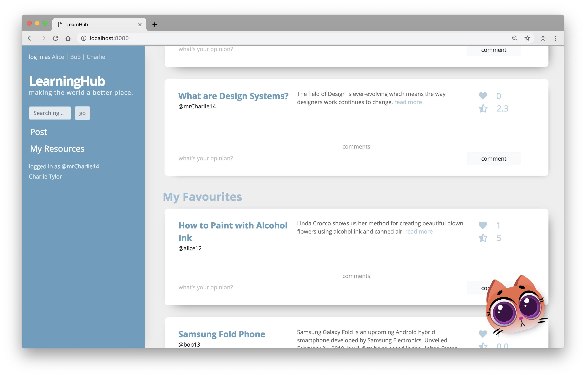
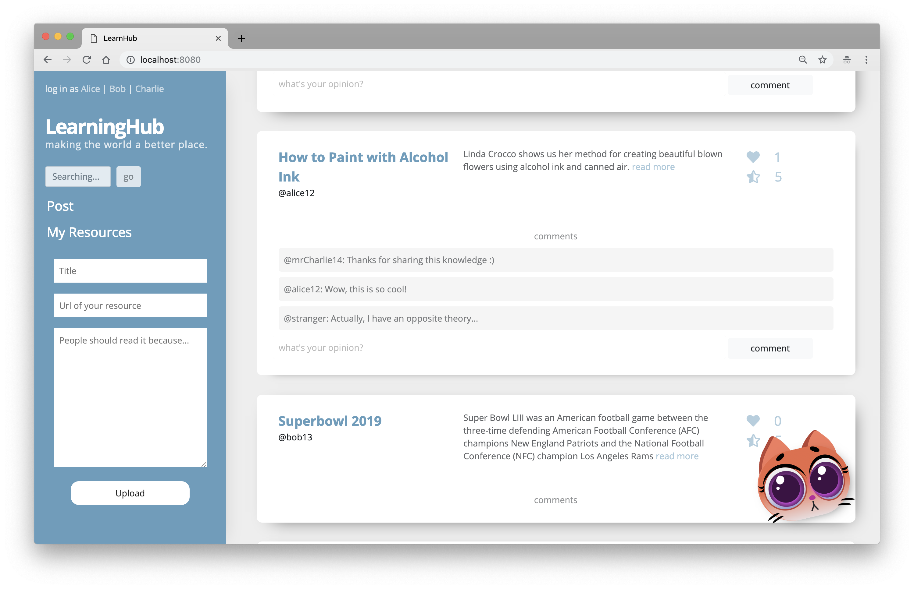

# Learning Hub

Learning Hub (aka Resource Wall) is a simple, single-page web application, just like Pinterest for learners. It allows learners to save learning resources like tutorials, blogs and videos in a central place that is publicly available to any user.

## Getting Started
1. Create the .env by using .env.example as a reference: cp .env.example .env
2. Update the .env file with your correct local information
3. Install dependencies: npm i
4. Fix to binaries for sass: npm rebuild node-sass
5. Run migrations: npm run knex migrate:latest
   Check the migrations folder to see what gets created in the DB
6. Run the seed: npm run knex seed:run
   Check the seeds file to see what gets seeded in the DB
7. Run the server: npm run local
8. Visit http://localhost:8080/

## Final Product 

- creating a post

- keyword search

- my resources

- comments section

## Dependencies 
- Node 5.10.x or above
- NPM 3.8.x or above
- body-parser 1.15.2 or above
- cookie-session 1.3.3 or above
- bookshelf 0.14.2 or above
- dotenv 2.0.0 or above
- ejs 2.4.1 or above
- express 4.13.4 or above
- knex 0.16.3 or above
- knex-logger 0.1.0 or above
- morgan 1.7.0 or above
- node-sass-middleware 0.9.8 or above
- pg 6.4.2 or above
